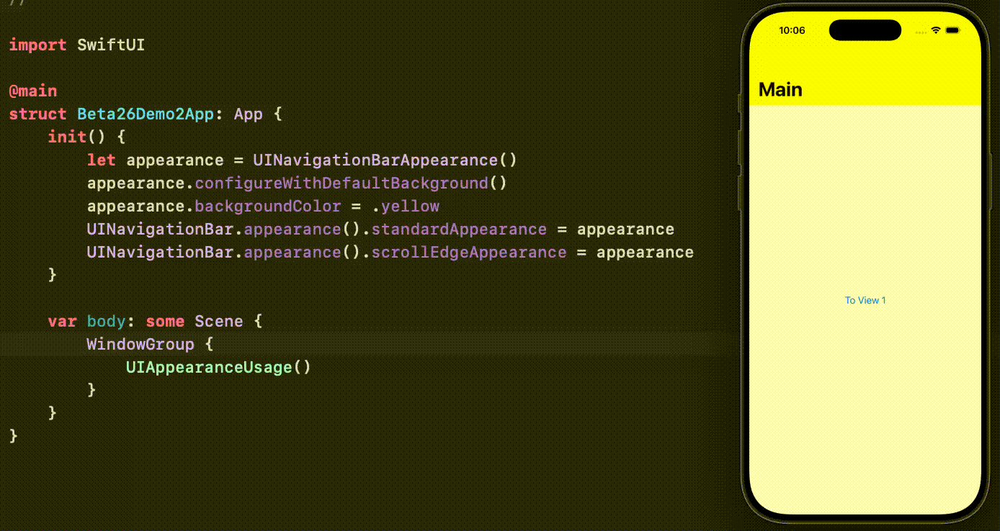

# UIAppearance Protocol Demo
 
A demo of using [UIAppearance](https://developer.apple.com/documentation/UIKit/UIAppearance) to set Style(s) For ALL Instances of a View At Once.

Specifically, this demo use the protocol to set the navigation bar tint without the needs of attaching any additional view modifiers to individual destination views.

For more details, please check out my article: [SwiftUI: Set Style(s) For ALL Instances of a View At Once!]()

